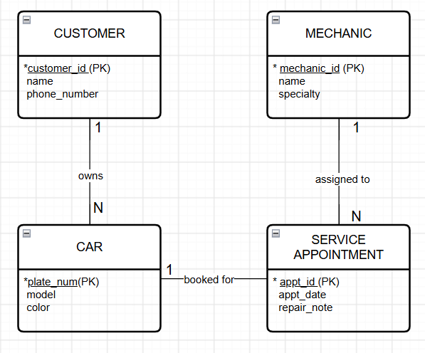

# INFOMAN1 – Week 2 Lab: Conceptual ERD Case Study
**Name:** Erika
**Student ID:** 2510184
**Section:** BSCS III

## Task 1 — Candidate Entities

| Entity | Justification |
|---|---|
| Customer | The scenario states "the shop has many customers," making Customer a distinct real-world object with its own attributes, rather than a single attribute describing something else. |
| Car | The scenario notes each car has specific attributes like model, plate number, and color, and can be brought in for service independently. |
| Mechanic | The scenario explicitly states the shop employs several mechanics who have individual names and specialties, identifying them as independent entities. |
| Service Appointment | The scenario notes that a mechanic works on a car during a scheduled service appointment which records a date and short repair note, making it an event entity linking cars and mechanics. |

## Task 2 — Attributes per Entity

### Customer
- Primary Key: customer_id
- Attributes:
  - customer_id — Domain: Integer (Auto-increment, Unique)
  - name — Domain: Text (String)
  - phone_number — Domain: String / Text

### Car
- Primary Key: plate_number
- Attributes:
  - plate_number — Domain: Text / Alphanumeric (String)
  - model — Domain: Text (String)
  - color — Domain: Text (String)

### Mechanic
- Primary Key: mechanic_id
- Attributes:
  - mechanic_id — Domain: Integer (Auto-increment, Unique)
  - name — Domain: Text (String)
  - specialty — Domain: Text (e.g. engine, brakes, electrical)

### Service Appointment
- Primary Key: appointment_id
- Attributes:
  - appointment_id — Domain: Integer (Auto-increment, Unique)
  - appointment_date — Domain: Date
  - repair_note — Domain: Text

## Task 3 — Relationships

| Relationship (verb phrase) | Between | Cardinality | Checked both directions? |
|---|---|---|---|
| owns | Customer ↔ Car | 1:N | Yes — one Customer may bring in one or more cars, but each Car belongs to exactly one Customer. |
| booked for | Car ↔ Service Appointment | 1:N | Yes — one Car may be scheduled for many Service Appointments over time, but each Service Appointment is created for exactly one Car visit. |
| assigned to | Mechanic ↔ Service Appointment | 1:N | Yes — one Mechanic works on many Service Appointments over time, but each Service Appointment is handled by one Mechanic. |

*Note on Mechanics and Cars:* The relationship between Mechanic and Car is a Many-to-Many ($M:N$) relationship represented through the **Service Appointment** entity, as a mechanic services many cars and a car can be serviced by many mechanics across different visits.

## Task 4 — Conceptual ERD

