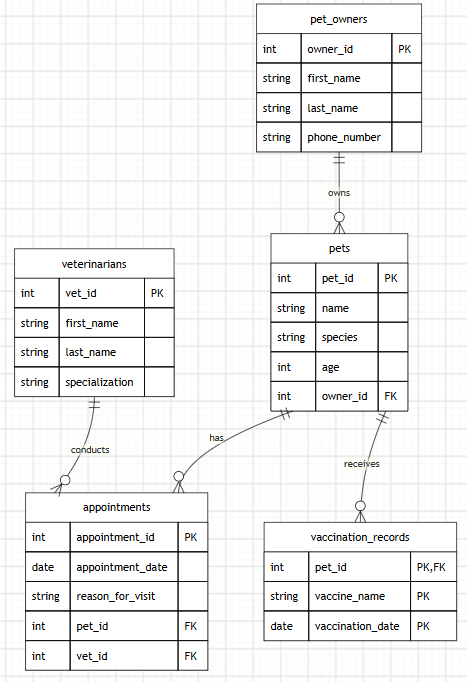

# INFOMAN1 – Week 3 Lab: Logical ERD Modeling 2

**Name:** Erika  
**Student ID:** 2510184  
**Section:** BSCS III  

---

## Task 1 — Classify Attributes and Identify Weak Entities

### 1. Attribute Classification
* **Composite Attribute**: `full_name` (in Pet Owner and Veterinarian).
  * *Reasoning*: `full_name` breaks down into `first_name` and `last_name`, which allows searching or sorting by last name in queries.
* **Multivalued Attribute**: `vaccination history` (in Pet).
  * *Reasoning*: The scenario states a pet can have "zero, one, or several vaccination records." To follow 1NF, this multivalued attribute must be stored in a separate table.
* **Derived Attribute**: None.
  * *Reasoning*: `age` is recorded directly rather than calculated from a `date_of_birth` field.

### 2. Weak Entity Determination
* **Weak Entity**: `Vaccination Record`
* *Justification*: A weak entity cannot be uniquely identified by its own attributes alone and depends on a strong parent entity. The scenario notes that a vaccination record "only makes sense in relation to the specific pet it belongs to" and "cannot be uniquely identified or looked up on its own." Thus, `Vaccination Record` depends on `Pet` and uses a composite key (`pet_id` + `vaccine_name` + `vaccination_date`).

---

## Task 2 — Specify Cardinality & Participation

1. **Owner ↔ Pet**
   * **Owner to Pet**: `Optional | Many` (`O|`)
     * *Evidence*: "A pet owner ... is not required to have any pets on file at a given time..."
   * **Pet to Owner**: `Mandatory | One` (`||`)
     * *Evidence*: "...every pet must belong to exactly one owner."

2. **Pet ↔ Appointment**
   * **Pet to Appointment**: `Optional | Many` (`O|`)
     * *Evidence*: A pet can exist in the system without an appointment or have multiple appointments over time.
   * **Appointment to Pet**: `Mandatory | One` (`||`)
     * *Evidence*: "...and it must specify exactly one veterinarian and exactly one pet—an appointment cannot exist without both."

3. **Veterinarian ↔ Appointment**
   * **Veterinarian to Appointment**: `Optional | Many` (`O|`)
     * *Evidence*: "A veterinarian ... can conduct multiple appointments over time or none at all."
   * **Appointment to Veterinarian**: `Mandatory | One` (`||`)
     * *Evidence*: "...and it must specify exactly one veterinarian and exactly one pet—an appointment cannot exist without both."

4. **Pet ↔ Vaccination Record**
   * **Pet to Vaccination Record**: `Optional | Many` (`O|`)
     * *Evidence*: "...a pet may have zero, one, or several vaccination records..."
   * **Vaccination Record to Pet**: `Mandatory | One` (`||`)
     * *Evidence*: "...each vaccination record only makes sense in relation to the specific pet it belongs to..."

---

## Task 3 — Logical ERD

---

## Task 4 — Relational Schema Notation

* `pet_owners` (<u>`owner_id`</u>, `first_name`, `last_name`, `phone_number`)
* `pets` (<u>`pet_id`</u>, `name`, `species`, `age`, `owner_id`*)  
  * *FK: `owner_id` references `pet_owners(owner_id)`*
* `veterinarians` (<u>`vet_id`</u>, `first_name`, `last_name`, `specialization`)
* `appointments` (<u>`appointment_id`</u>, `appointment_date`, `reason_for_visit`, `pet_id`*, `vet_id`*)  
  * *FK: `pet_id` references `pets(pet_id)`*  
  * *FK: `vet_id` references `veterinarians(vet_id)`*
* `vaccination_records` (<u>`pet_id`*</u>, <u>`vaccine_name`</u>, <u>`vaccination_date`</u>)  
  * *FK: `pet_id` references `pets(pet_id)`*

---

## Task 5 — Key Justification & Schema Validation

### 1. Primary Key Justifications
* **`pet_owners` (`owner_id`) — Surrogate Key**:
  * An auto-incrementing surrogate key was used instead of a phone number or full name. Phone numbers can change or be shared, so `owner_id` provides an immutable primary key.
* **`vaccination_records` (`pet_id`, `vaccine_name`, `vaccination_date`) — Composite Key**:
  * As a weak entity, `Vaccination Record` lacks a standalone primary key. Combining the foreign key (`pet_id`) with `vaccine_name` and `vaccination_date` uniquely identifies each record.

### 2. Line-by-Line Scenario Validation

* **"A pet owner, identified by an owner ID, full name (consisting of first name and last name), and phone number..."**  
  -> Represented in `pet_owners` with `owner_id` (PK), `first_name`, `last_name`, and `phone_number`.
* **"...is not required to have any pets on file ... but every pet must belong to exactly one owner."**  
  -> Represented in `pets` with `owner_id` as a required Foreign Key linking to `pet_owners`.
* **"A pet has a pet ID, name, species, and age."**  
  -> Represented in `pets` with `pet_id` (PK), `name`, `species`, and `age`.
* **"Every appointment record tracks an appointment ID, appointment date, and reason for visit..."**  
  -> Represented in `appointments` with `appointment_id` (PK), `appointment_date`, and `reason_for_visit`.
* **"...must specify exactly one veterinarian and exactly one pet—an appointment cannot exist without both."**  
  -> Represented in `appointments` with `pet_id` (FK) and `vet_id` (FK) as non-null foreign keys.
* **"A veterinarian, identified by a vet ID, full name, and specialization..."**  
  -> Represented in `veterinarians` with `vet_id` (PK), `first_name`, `last_name`, and `specialization`.
* **"...tracks each pet's vaccination history... zero, one, or several... cannot be uniquely identified or looked up on its own."**  
  -> Represented in `vaccination_records` with composite key (`pet_id`, `vaccine_name`, `vaccination_date`).